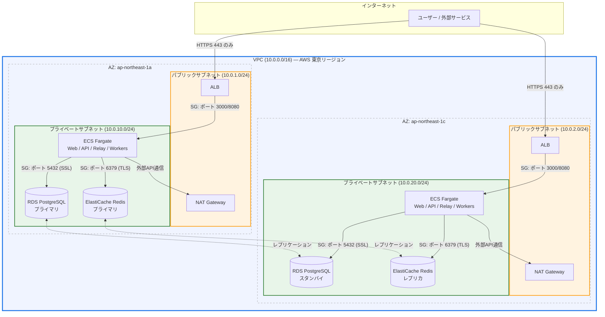
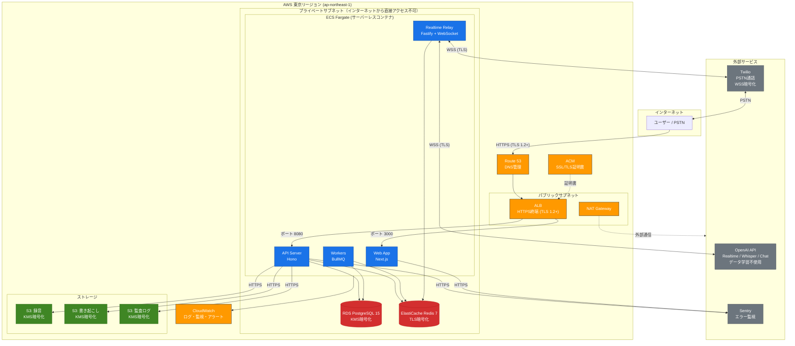
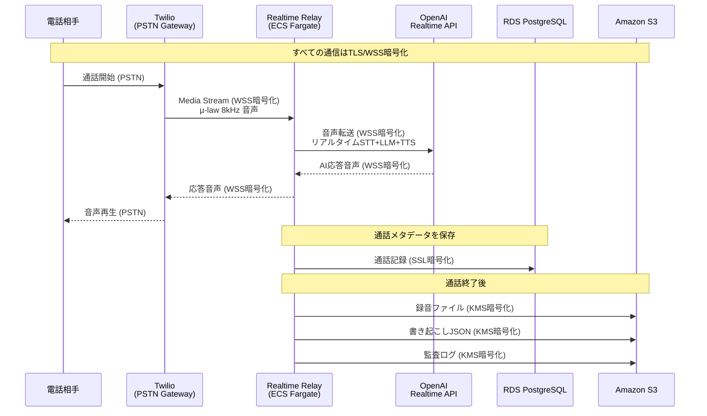

# Callsmith セキュリティガイド

> 本ドキュメントは Callsmith のセキュリティ対策・プライバシー保護・コンプライアンス対応をまとめたものです。
> 営業資料・顧客向け説明・社内監査の基礎資料として活用できます。

---

## 目次

1. [AIモデルとデータの取り扱い](#1-aiモデルとデータの取り扱い)
2. [サーバーリージョンとインフラ構成](#2-サーバーリージョンとインフラ構成)
3. [クローズドなサーバー環境](#3-クローズドなサーバー環境)
4. [通信の暗号化](#4-通信の暗号化)
5. [個人情報漏洩対策](#5-個人情報漏洩対策)
6. [準拠するセキュリティ基準](#6-準拠するセキュリティ基準)
7. [システム構成図](#7-システム構成図)
8. [営業資料向けサマリー](#8-営業資料向けサマリー)

---

## 1. AIモデルとデータの取り扱い

### OpenAI API のデータポリシー

Callsmith は OpenAI の **API（Business向け）** を利用しており、一般消費者向けの ChatGPT とは異なるデータポリシーが適用されます。

| 項目 | 内容 |
|------|------|
| **モデル学習への利用** | **されません。** 2023年3月1日以降、OpenAI API に送信されたデータはモデルのトレーニングに使用されません（明示的にオプトインしない限り）。Callsmith はオプトインしていません。 |
| **データ保持期間** | 不正使用監視ログとして最大30日間保持されますが、プロンプト・応答の内容はモデル改善に使用されません。 |
| **Zero Data Retention (ZDR)** | エンタープライズ向けにはZDR（ゼロデータ保持）オプションも利用可能です。ZDR適用時は不正使用ログからも顧客コンテンツが除外されます。 |

> **参照**: [OpenAI Platform - Data Controls](https://developers.openai.com/api/docs/guides/your-data/)

### 利用している OpenAI API

| API | モデル | 用途 |
|-----|--------|------|
| Realtime API | gpt-realtime-mini | リアルタイム音声会話（STT + LLM + TTS統合） |
| Chat Completions API | gpt-4o-mini | 受付応答の分類（構造化出力） |
| Whisper API | whisper-1 | 音声文字起こし（日本語） |

### 重要なポイント

- **音声データはAIの学習用途に一切使用されません**
- API経由のデータ送信はすべてTLS暗号化通信で行われます
- 通話録音・書き起こしデータは自社管理のAWS S3に保存され、OpenAIサーバーには保持されません

---

## 2. サーバーリージョンとインフラ構成

### リージョン: 東京 (ap-northeast-1)

**すべてのインフラストラクチャは AWS 東京リージョン (ap-northeast-1) に配置されています。**

| コンポーネント | AWSサービス | リージョン |
|--------------|------------|-----------|
| アプリケーション基盤 | ECS Fargate（サーバーレスコンテナ） | ap-northeast-1 |
| データベース | Amazon RDS PostgreSQL 15 | ap-northeast-1 |
| キャッシュ | Amazon ElastiCache (Redis 7) | ap-northeast-1 |
| ファイルストレージ | Amazon S3 | ap-northeast-1 |
| ロードバランサー | Application Load Balancer (ALB) | ap-northeast-1 |
| DNS管理 | Amazon Route 53 | グローバル |
| SSL/TLS証明書 | AWS Certificate Manager (ACM) | ap-northeast-1 |
| ログ管理 | Amazon CloudWatch Logs | ap-northeast-1 |
| エラー監視 | Sentry | - |

### データ主権

- 顧客データ（通話録音、書き起こし、連絡先情報）はすべて **日本国内のAWSデータセンター** に保存されます
- データの海外転送は行いません（OpenAI APIへの一時的なリクエスト送信を除く）

---

## 3. クローズドなサーバー環境

### VPCによるネットワーク分離

Callsmith のインフラストラクチャはAWS VPC（Virtual Private Cloud）内に構築された **クローズドなネットワーク環境** で運用されています。



> **プライベートサブネット内のリソース（RDS / ElastiCache / ECS）はインターネットから直接アクセスできません。**
> 外部との通信はNAT Gatewayを経由し、受信トラフィックはALB経由のHTTPS (443) のみ許可されています。

### セキュリティグループによるアクセス制御

| セキュリティグループ | 許可される通信 |
|-------------------|-------------|
| ALB (callsmith-alb-sg) | インターネットからのHTTPS (443) のみ受付 |
| ECS (callsmith-ecs-sg) | ALBからの通信のみ受付（ポート3000/8080） |
| RDS (callsmith-rds-sg) | ECSタスクからのPostgreSQL (5432) のみ受付 |
| Redis (callsmith-redis-sg) | ECSタスクからのRedis (6379) のみ受付 |

### ポイント

- **データベース・キャッシュはプライベートサブネットに配置** され、インターネットから直接アクセスできません
- アプリケーションサーバーもプライベートサブネットで稼働し、ALBを経由してのみアクセス可能です
- マルチAZ構成（ap-northeast-1a / ap-northeast-1c）による高可用性を確保

---

## 4. 通信の暗号化

### すべての通信経路を暗号化

```
ユーザー ──[HTTPS/TLS 1.2+]──▶ ALB ──▶ ECSアプリケーション
                                          │
                              [TLS暗号化] ├──▶ RDS PostgreSQL (SSL必須)
                                          ├──▶ ElastiCache Redis (TLS暗号化)
                                          ├──▶ OpenAI API (HTTPS/WSS)
                                          └──▶ Twilio API (HTTPS/WSS)
```

| 通信経路 | 暗号化方式 |
|---------|-----------|
| ユーザー ↔ ALB | TLS 1.2以上（ACM証明書、ELBSecurityPolicy-TLS13-1-2-2021-06） |
| ALB ↔ アプリケーション | VPC内部通信 |
| アプリケーション ↔ データベース | PostgreSQL SSL（sslmode=require） |
| アプリケーション ↔ Redis | ElastiCache TLS暗号化 |
| アプリケーション ↔ OpenAI | HTTPS / WSS (TLS) |
| アプリケーション ↔ Twilio | HTTPS / WSS (TLS) |
| 音声ストリーミング | WebSocket over TLS (WSS) |

### 保存データの暗号化

| 保存先 | 暗号化方式 |
|-------|-----------|
| RDS PostgreSQL | AWS KMS マネージドキーによる暗号化（保存時） |
| S3（録音・書き起こし・監査ログ） | SSE-S3 暗号化 + KMS管理キー |
| ElastiCache Redis | 保存時暗号化有効 |
| 環境変数（本番） | dotenvx による暗号化管理 |

---

## 5. 個人情報漏洩対策

### 多層防御アプローチ

#### 認証・認可

| 対策 | 詳細 |
|------|------|
| OAuth 2.0認証 | Google OAuth によるシングルサインオン |
| JWT セッション管理 | httpOnly / secure / SameSite=lax Cookie |
| CSRF保護 | CSRFトークンによるリクエスト検証 |

#### データ保護

| 対策 | 詳細 |
|------|------|
| 通信暗号化 | 全通信経路でTLS 1.2以上を強制 |
| 保存時暗号化 | AWS KMS によるデータベース・ストレージの暗号化 |
| ネットワーク分離 | VPCプライベートサブネットによるDB/キャッシュの隔離 |
| 自動バックアップ | RDS 7日間自動バックアップ + ポイントインタイムリカバリ |

#### 録音データの管理

| 対策 | 詳細 |
|------|------|
| S3暗号化保存 | KMS管理キーで暗号化保存 |
| ライフサイクル管理 | 90日後にGlacierへ自動アーカイブ（法令対応） |
| アクセス制御 | IAMロールによる最小権限アクセス |
| 監査ログ | 操作ログをS3に暗号化保存 |

#### CI/CDセキュリティ

| 対策 | 詳細 |
|------|------|
| OIDC認証 | GitHub Actions → AWS間はOIDCロール引受け（長期キー不使用） |
| シークレット管理 | 本番環境変数はdotenvxで暗号化、復号キーはGitHub Secretsで管理 |
| コンテナセキュリティ | Alpine Linuxベース最小イメージ、非rootユーザー実行 |

#### 外部サービスとの連携

| サービス | データ送信内容 | 保護措置 |
|---------|-------------|---------|
| OpenAI API | 音声データ・テキスト | TLS暗号化通信、APIデータは学習不使用 |
| Twilio | 通話音声ストリーム | WSS暗号化、通話データはTwilio側で暗号化保存 |
| Sentry | エラーログ | 個人情報を含まないエラー情報のみ送信 |

---

## 6. 準拠するセキュリティ基準

### OWASP LLM Security Verification Standard (LLMSVS)

設計・開発・テストの各段階において、[OWASP LLM SVS](https://owasp.org/www-project-llm-verification-standard/) に基づくセキュリティ要件を考慮しています。

| LLMSVS カテゴリ | Callsmith の対応 |
|----------------|-----------------|
| プロンプトインジェクション対策 | 構造化出力（JSON Schema）による応答制御、システムプロンプトの分離 |
| データ漏洩防止 | APIデータの学習不使用ポリシー、通信暗号化 |
| モデル出力の検証 | Temperature=0設定による決定的出力、構造化出力による型安全性 |
| 過剰な権限の制限 | API呼び出しの最小権限設計、タイムアウト制御 |
| 安全でないプラグイン | 外部ツール呼び出しの制限、入力バリデーション |

### 総務省ガイドライン

[総務省「クラウドサービス提供における情報セキュリティ対策ガイドライン（第3版）」](https://www.soumu.go.jp/menu_news/s-news/01cyber01_02000001_00121.html)の要件に対する対応状況:

| ガイドライン要件 | 対応状況 |
|----------------|---------|
| データセンターの物理的安全性 | AWS東京リージョンのデータセンター（ISO 27001等認証取得済み） |
| ネットワークセキュリティ | VPC、セキュリティグループ、TLS暗号化 |
| データの暗号化 | 保存時・通信時ともに暗号化 |
| アクセス制御 | OAuth 2.0認証、IAMロール、最小権限原則 |
| 可用性の確保 | マルチAZ構成、自動バックアップ、ECS Fargate自動復旧 |
| データの所在地 | 日本国内（東京リージョン）に保存 |
| 監査ログ | 操作ログ・監査ログのS3暗号化保存 |
| インシデント対応 | CloudWatch監視、Sentryアラート、SNS通知 |

### AWS セキュリティ認証

Callsmith が利用するAWSは以下の認証を取得しています:

- ISO 27001 / 27017 / 27018
- SOC 1 / SOC 2 / SOC 3
- PCI DSS Level 1
- ISMAP（政府情報システムのためのセキュリティ評価制度）

---

## 7. システム構成図



### 通信フロー（音声通話）



---

## 8. 営業資料向けサマリー

> 以下は営業資料・提案書に転記可能なセキュリティ訴求テキストです。

---

### 安心の基準のセキュリティ

#### データはAIの学習に使用されません

Callsmith は OpenAI の Business API を利用しています。**API経由で送信されたお客様の音声データ・テキストデータは、AIモデルの学習（トレーニング）に一切使用されません。** これは OpenAI の公式ポリシーで保証されています。

#### 国内サーバーで完結

すべてのサーバー・データベース・ストレージは **AWS 東京リージョン（日本国内）** に配置。お客様のデータは日本国内で安全に管理されます。

#### クローズドなサーバー環境

データベース・キャッシュサーバーは **VPCプライベートサブネット** に配置され、インターネットからの直接アクセスは完全に遮断。セキュリティグループによる厳格なアクセス制御を実施しています。

#### すべての通信を暗号化

すべての通信経路で **TLS 1.2以上の暗号化** を適用。音声ストリーミングも暗号化された WebSocket (WSS) で保護されます。保存データも **AWS KMS** による暗号化で保護されています。

#### セキュリティ基準への準拠

- **OWASP LLM SVS**: LLMアプリケーション特有のセキュリティリスクに対応した設計
- **総務省ガイドライン**: 「クラウドサービス提供における情報セキュリティ対策ガイドライン（第3版）」に準拠
- **AWS認証基盤**: ISO 27001 / SOC 2 / ISMAP 認証取得済みのインフラ上で運用

#### 個人情報の保護

- OAuth 2.0 によるセキュアな認証
- 録音データは暗号化保存、90日後に自動アーカイブ
- 監査ログによる操作追跡
- 最小権限の原則に基づくアクセス制御

---

## 付録: 外部サービス一覧

| サービス | 提供元 | 用途 | データポリシー |
|---------|-------|------|-------------|
| OpenAI API | OpenAI, Inc. | 音声会話AI | APIデータは学習不使用（2023年3月〜） |
| Twilio | Twilio, Inc. | 電話発着信・音声ストリーミング | SOC 2認証、通信暗号化 |
| AWS | Amazon Web Services | インフラ全般 | ISO 27001 / SOC 2 / ISMAP |
| Sentry | Functional Software, Inc. | エラー監視 | 個人情報非送信 |

---

*最終更新: 2026年3月*
