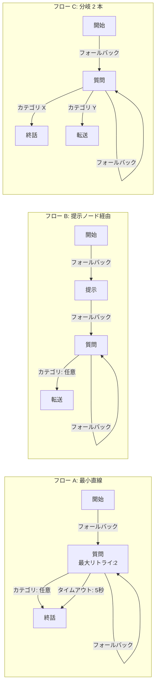

# 受付突破 — QA チェックリスト

> 最終更新: 2026-03-09
> 仕様の詳細は [仕様書](仕様書.md) を参照してください。

---

## テスト準備

### テスト用のロジックフロー

以下の 3 パターンのフローを事前に用意してください。すべてのノードにダミー音声アセットを紐付けておくこと。

---

## A. 画面操作系

> Web UI の画面遷移・表示・操作が正しく動作するかを検証します。

### A-1. タブ・画面表示

- [ ] **A01** — シナリオ画面を開くと「実行」「ロジック」「音声」「転送」「履歴」の 5 タブが表示される
- [ ] **A02** — 各タブをクリックすると対応する画面に切り替わる

### A-2. ロジックフロー編集

- [ ] **A03** — 「ロジック」タブを開くと「ロジックツリー（閲覧）」と表示され、「ノード：N / 分岐：M」が確認できる
- [ ] **A04** — 「編集」ボタンをクリックすると「ロジックツリー（編集中）」に切り替わり、「ノード追加」「保存」ボタンが表示される
- [ ] **A05** — 編集モードで「ノード追加」をクリックすると「新規ノード」がキャンバスに追加される
- [ ] **A06** — ノード間をドラッグするとエッジが作成され、右パネルに「条件種別」の設定が表示される
- [ ] **A07** — ノードを選択して右パネルで「ラベル」「スクリプト」「音声アセット」「最大リトライ回数」が変更できる
- [ ] **A08** — エッジを選択して右パネルで「条件種別」（カテゴリ/タイムアウト/フォールバック）・「優先度」が変更できる
- [ ] **A09** — 編集 → 「保存」→ ページリロードすると、「保存しました」通知が出て、再読込後も変更内容が維持される
- [ ] **A10** — 「シミュレーション」ボタンからカテゴリを選択すると、開始ノードから遷移をステップ実行でき、転送/終話ノードで終了する

### A-3. 音声アセット管理

- [ ] **A11** — 「音声」タブを開くと「音声アセット管理」画面に「合計：N」とアセット一覧が表示される
- [ ] **A12** — 「音声アップロード」でファイルを選択すると進捗表示 → 完了後に一覧に追加される
- [ ] **A13** — ドラッグ & ドロップでファイルをアップロードできる
- [ ] **A14** — アセット行の「再生」ボタンでブラウザ上の音声再生ができ、ボタンが「停止」に変わる
- [ ] **A15** — アセットを削除すると一覧から消える

### A-4. 転送先管理

- [ ] **A16** — 「転送」タブを開くと登録済みの転送先が優先度順で表示される
- [ ] **A17** — 「追加」→ モーダルで名前・電話番号を入力 → 保存すると「追加しました」通知、一覧に追加される
- [ ] **A18** — 「上へ」「下へ」矢印ボタンで優先度を入れ替えられる
- [ ] **A19** — 「有効」スイッチで有効/無効が切り替わり、「更新しました」通知が出る
- [ ] **A20** — 「削除」で「削除しました」通知、一覧から消える
- [ ] **A21** — 「編集」→ モーダルで名前・電話番号を変更 → 保存すると「更新しました」通知、変更が反映される

### A-5. テスト架電

- [ ] **A22** — 「実行」タブを開くと電話番号入力フォームと「テスト架電開始」ボタンが表示される
- [ ] **A23** — バリデーションエラーがあると「テスト架電開始」ボタンが無効、エラー一覧が表示される

### A-6. 通話履歴

- [ ] **A24** — 「履歴」タブを開くと過去の通話一覧が表示される
- [ ] **A25** — 通話の詳細を開くとタイムラインが時系列で表示される

---

## B. ロジック分岐系

> ロジックフローのノード遷移・分岐が正しく動作するかを検証します。
> テスト架電（実通話またはモック）で確認してください。

### B-1. ノードタイプ基本動作

- [ ] **B01**〔フロー A〕 **開始**ノード: 音声再生完了後に発話待機状態になる
- [ ] **B02**〔フロー B〕 **提示**ノード: 音声再生完了後にリスニングなしで次のノードに進む
- [ ] **B03**〔フロー A〕 **質問**ノード: 音声再生 → 発話待機 → 判定 → エッジ条件で遷移する
- [ ] **B04**〔フロー B〕 **転送**ノード: 音声再生完了後に転送先への発信が行われる
- [ ] **B05**〔フロー A〕 **終話**ノード: 音声再生完了後に通話が切断される

### B-2. エッジ条件分岐

- [ ] **B06**〔フロー A〕 **カテゴリ**エッジ: 分類結果と一致するエッジで終話ノードに遷移する
- [ ] **B07**〔フロー C〕 異なるカテゴリで異なるノードに遷移する（カテゴリ X → 終話、カテゴリ Y → 転送）
- [ ] **B08**〔フロー A〕 **フォールバック**エッジ: どのカテゴリにもマッチしない場合に質問ノード自身に戻る
- [ ] **B09**〔フロー A〕 **タイムアウト**エッジ: 5 秒間発話なしで終話ノードに遷移する

### B-3. リトライ

- [ ] **B10**〔フロー A〕 判定不能で同ノードにリトライし、音声が再度再生される
- [ ] **B11**〔フロー A〕 最大リトライ回数（2 回）到達でタイムアウト/フォールバックエッジで脱出する

### B-4. 割り込み（バージイン）

- [ ] **B12**〔フロー A〕 **質問**ノードの再生中に発話すると再生が中断され、聞き取り → 判定 → 遷移する
- [ ] **B13**〔フロー A〕 **開始**ノードの再生中に発話しても再生は中断されず最後まで再生される

### B-5. 転送

- [ ] **B14**〔フロー B〕 転送先が応答する → 通話結果が「担当者接続」になる
- [ ] **B15**〔フロー B〕 転送先が全員不応答 → 通話結果が「再架電予約」or「不通」になる
- [ ] **B16**〔フロー B〕 複数の転送先に優先度順（上から順）で逐次発信される

### B-6. イベント記録

- [ ] **B17**〔フロー A〕 開始 → 質問 → 終話の通話で、「履歴」タブのタイムラインに架電開始〜通話終了までの全イベントが記録される
- [ ] **B18**〔フロー A〕 タイムラインの経過時間が前のイベント以上（単調増加）になっている

---

## C. バリデーション系

> 不正な入力・操作に対してバリデーションが正しく機能するかを検証します。

### C-1. ロジックフローバリデーション

- [ ] **C01** — 開始ノードを全削除して保存すると「開始ノードは1つ必要です」エラーが表示される
- [ ] **C02** — 開始ノードを 2 つ追加して保存すると同上のエラーが表示される
- [ ] **C03** — 孤立したノードを追加して保存すると「ノード『○○』がルートから到達不可です」エラーが表示される
- [ ] **C04** — 音声アセットを未割当にして保存すると「ノード『○○』に音声アセットが紐付けられていません」エラーが表示される
- [ ] **C05** — 提示ノードにカテゴリエッジを追加して保存すると「提示ノード『○○』にはフォールバックエッジ1本のみ設定できます」エラーが表示される
- [ ] **C06** — 質問ノードのフォールバックエッジを削除して保存すると「質問ノード『○○』にフォールバックエッジが必要です」エラーが表示される
- [ ] **C07** — バリデーションエラーがある状態でも「保存」ボタンで保存でき、「保存しました（テスト架電には修正が必要です）」黄色通知が表示される
- [ ] **C08** — バリデーションエラーがある状態で「実行」タブを開くと「テスト架電開始」ボタンが無効でエラー一覧が表示される

### C-2. ノード操作の制約

- [ ] **C09** — 開始ノードが 1 つだけのとき「ノードを削除」ボタンが無効で削除できない
- [ ] **C10** — 開始ノードが 2 つあるとき、片方の「ノードを削除」が有効で削除できる
- [ ] **C11** — 「最大リトライ回数」に -1 や 11 を入力すると min/max 制約で弾かれる

### C-3. エッジ操作の制約

- [ ] **C12** — 「タイムアウト（秒）」に 0 や 31 を入力すると min/max 制約で弾かれる
- [ ] **C13** — 「優先度」に -1 や 1001 を入力すると min/max 制約で弾かれる

### C-4. 音声アセットバリデーション

- [ ] **C14** — .txt ファイルをアップロードすると「対応形式は wav, mp3, m4a, ogg, webm です」エラー通知が出る
- [ ] **C15** — 10MB 超のファイルをアップロードすると「ファイルサイズが10MBを超えています」エラー通知が出る
- [ ] **C16** — 有効ファイル + 無効ファイルを同時にアップロードすると、無効ファイルのみ「ファイル検証エラー」通知、有効ファイルはアップロードされる
- [ ] **C17** — ステータスが「欠損」のアセットの再生ボタンをクリックすると「再生できません」通知が出る

### C-5. 転送先バリデーション

- [ ] **C18** — 5 件登録済みの状態で「追加」ボタンが無効になる
- [ ] **C19** — 「転送先を追加」モーダルで名前を空にして保存すると「名前を入力してください」エラーが出る
- [ ] **C20** — 電話番号に「abc」を入力して保存すると「有効な電話番号を入力してください」エラーが出る
- [ ] **C21** — 電話番号に `090-1234-5678` を入力して保存すると正常に保存される

### C-6. テスト架電バリデーション

- [ ] **C22** — 電話番号に「abc」を入力してテスト架電すると「電話番号が不正です」通知が出る
- [ ] **C23** — ロジックツリーが未作成の状態で「実行」タブを開くと「ロジックツリーが未作成です」エラー、ボタンが無効

### C-7. バージョン競合

- [ ] **C24** — ブラウザ A で保存後、ブラウザ B で古いバージョンのまま保存すると「競合が発生しました」モーダルが表示される
- [ ] **C25** — 「競合が発生しました」モーダルのボタンをクリックすると最新バージョンが再読込される

---

## テスト対象外（将来変わりうる部分）

以下はカテゴリ・判定ルール拡張時にテスト修正が必要です。

| 対象外項目 | 理由 |
|---|---|
| AI 分類の精度 | 判定ルール・カテゴリ定義に依存 |
| キーワード判定の一致結果 | 補助ルール定義に依存 |
| 特定カテゴリのエッジ遷移 | カテゴリ追加で条件値が変わる |
| 判定スコアの具体値 | AI の確信度やルールスコアは調整される |
