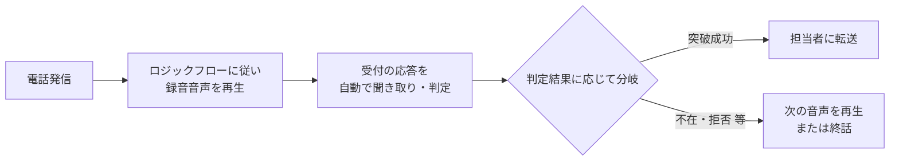
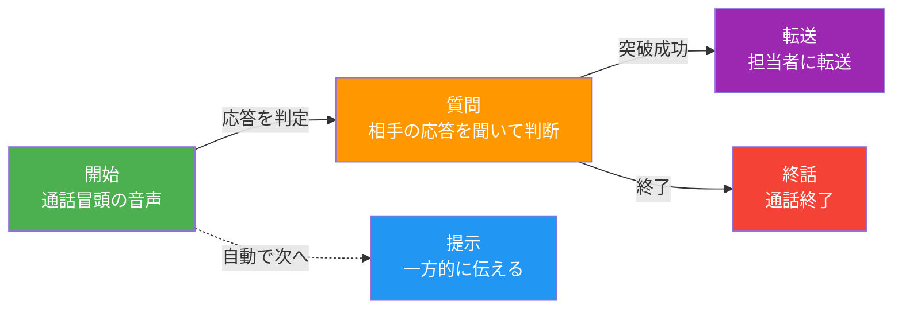
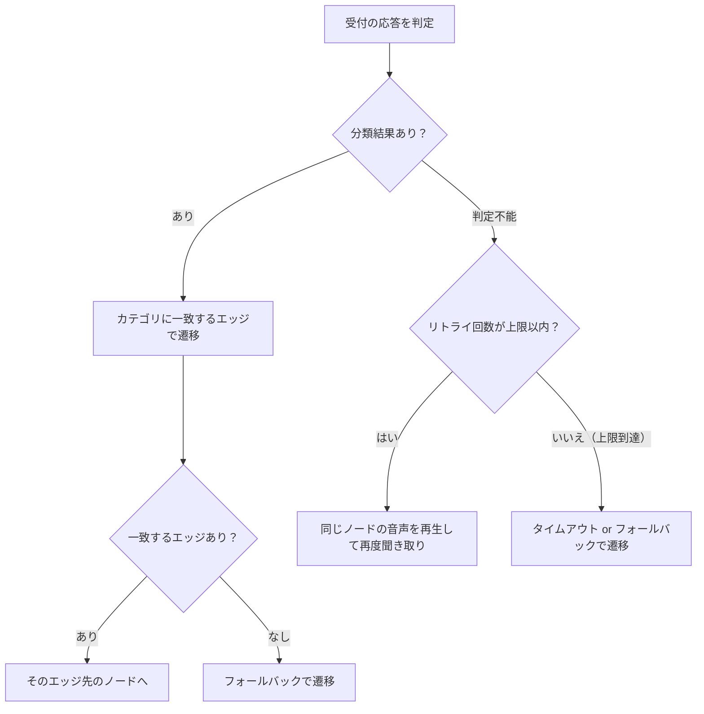
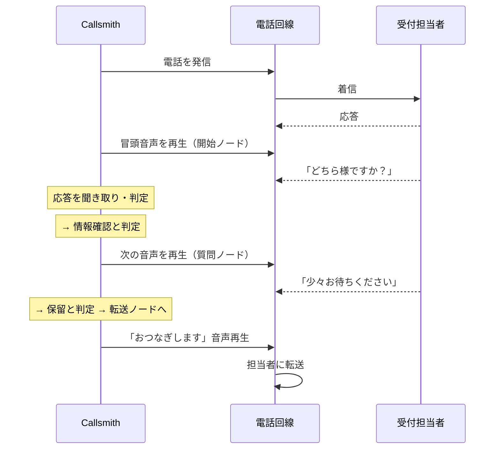
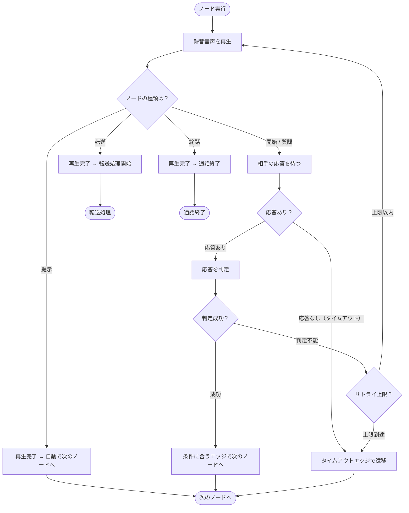
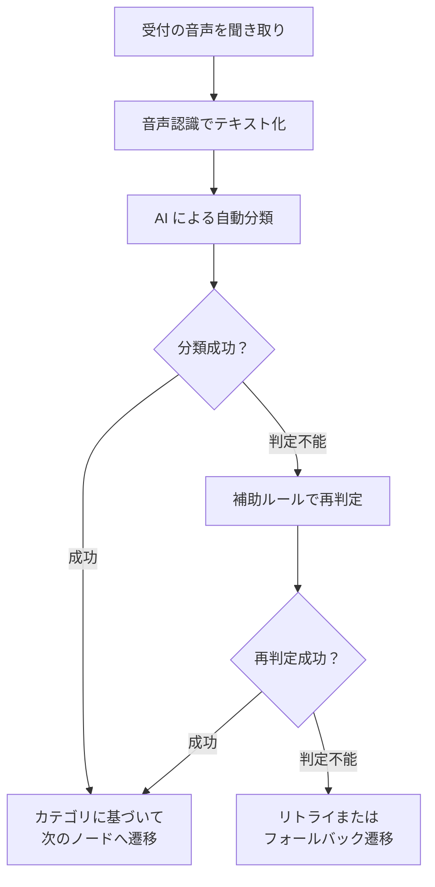
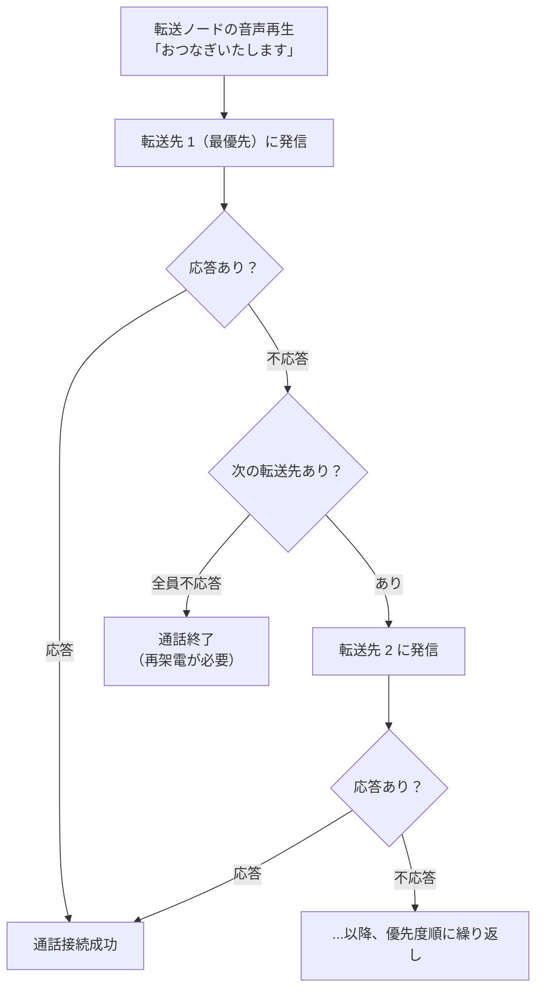
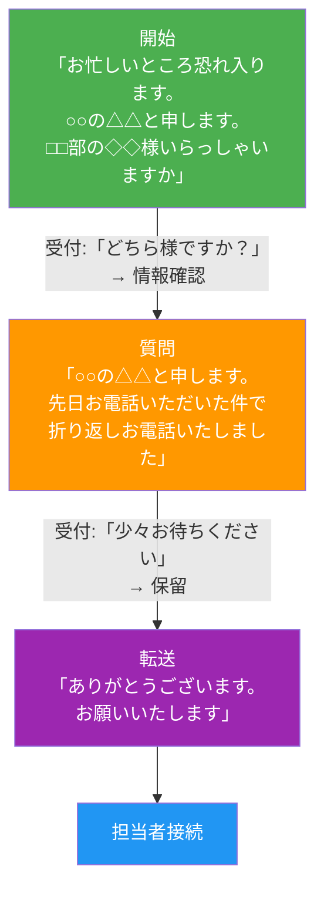
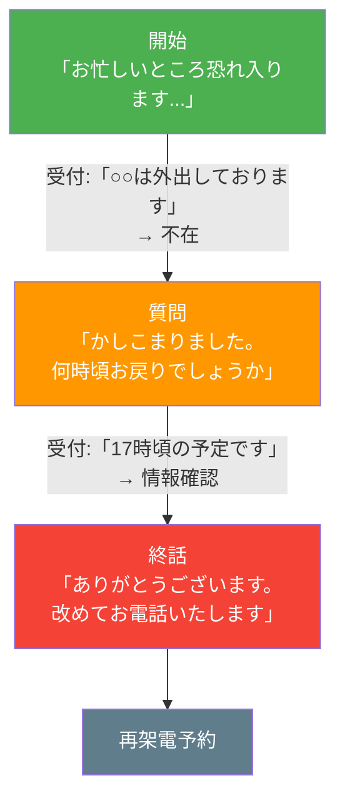
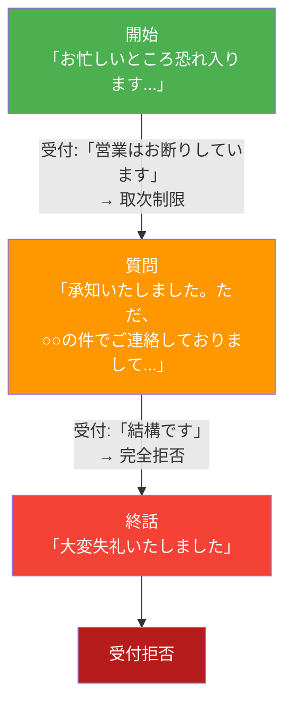

# 受付突破 — 機能仕様書

> 最終更新: 2026-03-09

---

## 目次

1. [概要](#1-概要)
2. [画面構成](#2-画面構成)
3. [ロジックフロー](#3-ロジックフロー)
4. [音声アセット管理](#4-音声アセット管理)
5. [転送先管理](#5-転送先管理)
6. [通話の流れ](#6-通話の流れ)
7. [応答の自動判定](#7-応答の自動判定)
8. [転送処理](#8-転送処理)
9. [通話履歴・タイムライン](#9-通話履歴タイムライン)
10. [典型的な通話パターン](#10-典型的な通話パターン)

---

## 1. 概要

受付突破は、企業への営業電話において**受付担当者を自動的に突破し、ターゲット担当者への転送**を実現する機能です。

### 特徴

| 項目 | 内容 |
|---|---|
| 音声 | 人間が事前に録音した音声を使用（AI 合成音声ではない） |
| 対話制御 | ロジックフロー（ツリー構造）に沿って自動で対話を進行 |
| 応答判定 | 受付の応答を自動で聞き取り・分類し、次のステップを決定 |
| 転送 | 受付を突破したら、登録済みの担当者に自動転送 |

### 全体の流れ

---

## 2. 画面構成

受付突破シナリオの管理画面は **5 つのタブ**で構成されます。

| タブ | できること |
|---|---|
| **実行** | テスト架電の開始。電話番号を入力して発信できる |
| **ロジック** | 対話フローの視覚的な編集（ノードの追加・接続・条件設定） |
| **音声** | 録音音声ファイルのアップロード・管理・ノードへの割り当て |
| **転送** | 転送先（担当者）の追加・優先度設定・有効/無効の切り替え |
| **履歴** | 過去の通話記録とタイムライン表示 |

---

## 3. ロジックフロー

### 3.1 ロジックフローとは

受付との対話の流れを**ノード（対話ステップ）**と**エッジ（遷移条件）**で定義する仕組みです。「ロジック」タブの視覚的なエディタで、ノードを配置し、線でつなぐことでフローを作成します。

### 3.2 ノードの種類

フローには 5 種類のノードがあります。

| ノード | 色 | 動作 |
|---|---|---|
| **開始** | 緑 | 通話開始時の冒頭音声を再生 → 相手の応答を待つ |
| **提示** | 青 | 音声を再生 → 応答を待たずに自動で次のノードへ進む |
| **質問** | オレンジ | 音声を再生 → 相手の応答を聞き取り → 判定結果に応じて分岐 |
| **転送** | 紫 | 音声を再生 → 担当者への転送処理を開始 |
| **終話** | 赤 | 音声を再生 → 通話を終了 |

### 3.3 ノードの設定項目

ノードを選択すると、右パネルに以下の設定項目が表示されます。

| 設定項目 | 説明 |
|---|---|
| **ラベル** | ノードの表示名（例: 「冒頭挨拶」「用件説明」） |
| **スクリプト** | 録音音声の台本テキスト（参考用のメモ） |
| **音声アセット** | このノードで再生する録音音声ファイル |
| **最大リトライ回数** | 応答を聞き取れなかった場合の再試行回数（0〜10 回） |

### 3.4 エッジ（遷移条件）の種類

ノード間をつなぐ線（エッジ）には 3 種類の条件があります。

| 条件 | 説明 | 使いどころ |
|---|---|---|
| **カテゴリ** | 受付の応答が特定の分類に当てはまったときに遷移 | 「不在」→ 不在対応フロー、「保留」→ 転送フロー |
| **タイムアウト** | 一定時間（1〜30 秒）応答がなかったときに遷移 | 無言の場合の対応 |
| **フォールバック** | 上記どちらにも当てはまらなかったときの既定遷移 | 想定外の応答への対応 |

### 3.5 エッジの設定項目

エッジを選択すると、右パネルに以下の設定項目が表示されます。

| 設定項目 | 説明 |
|---|---|
| **条件種別** | カテゴリ / タイムアウト / フォールバック |
| **条件値** | カテゴリ名（カテゴリの場合）、秒数（タイムアウトの場合） |
| **優先度** | 同じ条件が複数あるときの優先順位（0〜1000、小さい方が優先） |

### 3.6 ノードタイプ別のエッジルール

| ノード | 使えるエッジ | 制約 |
|---|---|---|
| **開始** | カテゴリ、タイムアウト、フォールバック | フォールバック必須 |
| **提示** | フォールバックのみ | フォールバック 1 本のみ（他の種類は付けられない） |
| **質問** | カテゴリ、タイムアウト、フォールバック | フォールバック必須 |
| **転送** | なし | エッジ不要（転送処理に移行） |
| **終話** | なし | エッジ不要（通話終了） |

### 3.7 遷移の仕組み

### 3.8 テスト架電に必要な条件（バリデーション）

テスト架電を実行するには、ロジックフローが以下の条件を**すべて**満たす必要があります。
条件を満たさない場合、「実行」タブの「テスト架電開始」ボタンが無効になり、エラー内容が表示されます。

| # | 条件 | エラー表示 |
|---|---|---|
| 1 | 開始ノードが 1 つだけ存在する | 「開始ノードは1つ必要です」 |
| 2 | すべてのノードが開始ノードからたどれる | 「ノード『○○』がルートから到達不可です」 |
| 3 | すべてのノードに音声アセットが紐付いている | 「ノード『○○』に音声アセットが紐付けられていません」 |
| 4 | 提示ノードにはフォールバックエッジ 1 本のみ | 「提示ノード『○○』にはフォールバックエッジ1本のみ設定できます」 |
| 5 | 質問ノードにはフォールバックエッジが必須 | 「質問ノード『○○』にフォールバックエッジが必要です」 |

> **注:** バリデーションエラーがあっても**ロジックフローの保存自体は可能**です。「保存しました（テスト架電には修正が必要です）」と黄色の通知が表示されます。

### 3.9 バージョン管理

- ロジックフローを保存するたびに新しいバージョンとして記録されます
- 2 人が同時に編集した場合、後から保存した側に「競合が発生しました」ダイアログが表示されます
- ダイアログから「再読込」を選ぶと最新バージョンが読み込まれます

---

## 4. 音声アセット管理

### 4.1 概要

「音声」タブでは、各ノードで再生する録音音声ファイルを管理します。

### 4.2 対応フォーマット

| 項目 | 内容 |
|---|---|
| 対応形式 | wav, mp3, m4a, ogg, webm |
| 最大サイズ | 10 MB / ファイル |
| 自動変換 | アップロード後、通話に最適な形式に自動変換されます |

### 4.3 操作

| 操作 | 方法 |
|---|---|
| アップロード | 「音声アップロード」ボタン、またはドラッグ & ドロップ |
| 再生 | アセット行の「再生」ボタンをクリック |
| 削除 | アセット行の削除操作 |
| ノードへの割り当て | 「ロジック」タブのノード編集画面から選択 |

### 4.4 音声カテゴリ

音声アセットには以下のカテゴリが設定されます。

| カテゴリ | 用途 |
|---|---|
| 冒頭 | 通話開始時の挨拶 |
| クロージング | 通話終了時の挨拶 |
| 情報確認 | 「どちら様ですか」等への応答 |
| 不在 | 「不在です」への応答 |
| 取次制限 | 「営業お断り」への応答 |
| 権限不明 | 「担当がわからない」への応答 |
| 完全拒否 | 強い拒否への応答 |
| 外部化 | 「外部に委託」への応答 |
| 保留 | 「少々お待ちください」への応答 |

---

## 5. 転送先管理

### 5.1 概要

「転送」タブでは、受付突破後に電話をつなぐ担当者（転送先）を管理します。

### 5.2 仕様

| 項目 | 内容 |
|---|---|
| 最大登録数 | 5 件 |
| 並び順 | 優先度順（上にあるものが先に発信される） |
| 有効/無効 | スイッチで切り替え可能 |

### 5.3 設定項目

| 項目 | 説明 |
|---|---|
| **名前** | 転送先の表示名（例: 「営業部 田中」） |
| **電話番号** | 転送先の電話番号（ハイフンあり入力 → 自動で正規化） |
| **有効/無効** | 無効にすると転送先から除外される |
| **優先度** | 上下矢印で並び替え。上にあるものから順に発信 |

---

## 6. 通話の流れ

### 6.1 全体フロー

### 6.2 各ノードの動作サイクル

### 6.3 割り込み（バージイン）

**質問ノード**のみ、音声再生中に受付が話し始めた場合、再生を中断して相手の話を聞き取ります。

| ノード | 割り込み |
|---|---|
| 開始 | 無効（最後まで再生） |
| 質問 | **有効**（話し始めたら再生中断） |
| 提示 | ― （応答を待たない） |
| 転送 | ― （転送処理に移行） |
| 終話 | ― （通話終了） |

---

## 7. 応答の自動判定

### 7.1 判定の仕組み

受付の応答を音声認識でテキスト化し、以下の 7 カテゴリのいずれかに自動分類します。

| カテゴリ | 受付の応答例 |
|---|---|
| **情報確認** | 「どちら様ですか」「ご用件は？」「お名前を教えてください」 |
| **不在** | 「不在です」「席を外しております」「出張中です」 |
| **取次制限** | 「営業のお電話はお断りしています」「取り次ぎできません」 |
| **権限不明** | 「担当者がわかりません」「把握しておりません」 |
| **完全拒否** | 「結構です」「必要ありません」「二度とかけないでください」 |
| **外部化** | 「業者が決まっています」「外部に委託しております」 |
| **保留** | 「少々お待ちください」「確認いたします」 |

### 7.2 判定フロー

> **補足:** AI による分類が失敗した場合（タイムアウト等）、キーワードベースの補助ルールが自動で適用されます。

---

## 8. 転送処理

### 8.1 転送の流れ

転送ノードに到達すると、登録済みの転送先に**優先度順**で順番に発信します。

### 8.2 通話結果

| 結果 | 説明 |
|---|---|
| **担当者接続** | 転送先と通話が接続された（受付突破成功） |
| **受付拒否** | 受付に拒否されて通話終了 |
| **再架電予約** | 転送先が不応答等で、再度の架電が必要 |
| **不通** | 相手が電話に出なかった |
| **外部化** | 外部業者に委託されている旨の応答 |
| **エラー** | システムエラーで通話終了 |

---

## 9. 通話履歴・タイムライン

### 9.1 概要

「履歴」タブでは、過去の通話記録を一覧表示し、各通話のタイムラインを確認できます。

### 9.2 タイムラインに記録されるイベント

通話中のすべてのステップが時系列で記録されます。

| イベント | 内容 |
|---|---|
| 架電開始 | 電話が発信された |
| 音声再生開始 | ノードの録音音声の再生が始まった |
| 音声再生完了 | 録音音声の再生が終わった |
| 音声再生中断 | 割り込み等で再生が中断された |
| 発話検知 | 受付が話し始めた |
| 音声認識完了 | 受付の発話がテキスト化された |
| 応答分類 | 受付の応答がカテゴリに分類された |
| ノード遷移 | 次のノードに移動した |
| 転送開始 | 担当者への転送を開始した |
| 転送結果 | 転送の成否が確定した |
| 通話終了 | 通話が終了した |

---

## 10. 典型的な通話パターン

### 10.1 受付突破成功

### 10.2 不在対応

### 10.3 拒否対応

---

> QA テスト項目は [QA チェックリスト](QAチェックリスト.md) を参照してください。
